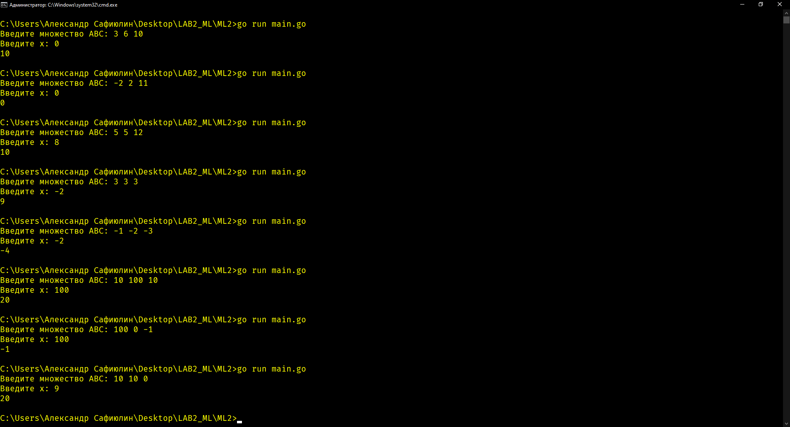

# Лабораторная работа №2
## Отчёт по лабораторной работе<br>по дисциплине "Математические основы программирования"<br>студента группы ПА-18-2<br>Сафиюлина Александра Александровича

### Постановка задачи

Тема: "Неформальное доказательство правильности программ, которые имеют разветвление"

Разделы лабораторной работы:
1. Написать программу в соответсвии с индивидуальным вариантом заданий (16 вариант);
2. Составить спецификацию и доказать правильность программы в ручном режиме по её спецификации с помощью фиксирования состояния программы после выполнения каждой команды.

#### Вариант 16

Имеем на входе множество {A, B, C}, причем элементы множества могут быть одинаковы. Вычислить сумму подмножества элементов ближайших к заданому X, если таких элементов больше, чем самых дальних от того же X, иначе - сумму подмножества элементов самых дальних от X.

### Описание решения:
    
1. Констатируем, что существует предусловие, код и постусловие `{Q} S {R}`, которые соответствуют поставленной задаче.

2. Составим предусловие:
  
  `Q: a ∧ b ∧ c ∧ x}`

3. Составим постусловие:
  
  `R : {
  	(Abs(a - x) == Abc(b - x) ∧ Abs(b - x) == Abs(c - x) ∧ result == a + b + c)
	 ∨
	 (Abs(a - x) == Abs(b - x) ∧ result == a + b)
	 ∨
	 (Abs(b - x) == Abs(c - x) ∧ result == b + c)
	 ∨
	 (Abs(a - x) == Abs(c - x) ∧ result == a + c)
	 |
	 (Abs(a - x) > Abs(b - x) ∧ Abs(a - x) > Abs(c - x) ∧ result == a)
	 ∨
	 (Abs(b - x) > Abs(a - x) ∧ Abs(b - x) > Abs(c - x) ∧ result == b)
	 ∨
	 (Abs(c - x) > Abs(a - x) ∧ Abs(c - x) > Abs(b - x) ∧ result == c)
  }`
  
  `where Abs(a) =(a < 0 ∧ result == -a) ∨ (a >= 0 ∧ result = a)`
  
  4. Составим спецификацию данной программы:
  
```Go

// a, b, c, x: A = a, B = b, C = c, X = x
func Task(a, b, c, x int) (int, error) {
	if math.Abs(a - x) == math.Abs(b - x) && math.Abs(b - x) == math.Abs(c - x) {
		// Abs(a - x) == Abs(b - x) & Abs(b - x) == Abs(c - x) & result = a + b + c
		return a + b + c, nil
	} else if math.Abs(a - x) == math.Abs(b - x) {
		// Abs(a - x) == Abs(b - x) ∧ result = a + b
		return a + b, nil
	} else if math.Abs(b - x) == math.Abs(c - x) {
		// Abs(b - x) == Abs(c - x) ∧ result = b + c
		return b + c, nil
	} else if math.Abs(a - x) == math.Abs(c - x) {
		// Abs(a - x) == Abs(c - x) ∧ result = a + c
		return a + c, nil
	} else if math.Abs(a - x) > math.Abs(b - x) && math.Abs(a - x) > math.Abs(c - x) {
		// Abs(a - x) > Abs(b - x) ∧ Abs(a - x) > Abs(c - x) ∧ result = a
		return a, nil
	} else if math.Abs(b - x) > math.Abs(a - x) && math.Abs(b - x) > math.Abs(c - x) {
		// Abs(b - x) > Abs(a - x) ∧ Abs(b - x) > Abs(c - x) ∧ result = b
		return b, nil
	} else if math.Abs(c - x) > math.Abs(a - x) && math.Abs(c - x) > math.Abs(b - x) {
		// Abs(c - x) > Abs(a - x) ∧ Abs(c - x) > Abs(b - x) ∧ result = c
		return c, nil
	} else {
		// We mustn't go here. but anyway...
		return 0, errors.New("Что-то сломалось...")
	}
}
// (Abs(a - x) == Abc(b - x) ∧ Abs(b - x) == Abs(c - x) ∧ result = a + b + c)
// ∨
// (Abs(a - x) == Abs(b - x) ∧ result = a + b)
// ∨
// (Abs(b - x) == Abs(c - x) ∧ result = b + c)
// ∨
// (Abs(a - x) == Abs(c - x) ∧ result = a + c)
// ∨
// (Abs(a - x) > Abs(b - x) ∧ Abs(a - x) > Abs(c - x) ∧ result = a)
// ∨
// (Abs(b - x) > Abs(a - x) ∧ Abs(b - x) > Abs(c - x) ∧ result = b)
// ∨
// (Abs(c - x) > Abs(a - x) ∧ Abs(c - x) > Abs(b - x) ∧ result = c)
```

### Тестовые примеры


